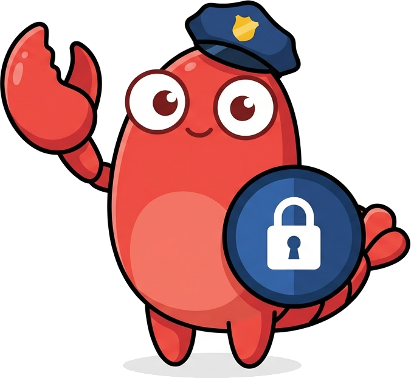

<p align="center">
  
</p>

# lulu-cli

Manage [LuLu](https://objective-see.org/products/lulu.html) firewall rules from the command line.

[LuLu](https://objective-see.org/products/lulu.html) is a free, open-source macOS firewall that blocks unknown outgoing connections. It has a GUI, but no way to manage rules programmatically. This CLI fills that gap -- useful for automation, scripting, and AI agents that need to manage their own network access.

## Requirements

- macOS 13+
- [LuLu](https://objective-see.org/products/lulu.html) installed
- `sudo` for write operations

## Install

```bash
# Homebrew (recommended, pre-built binary)
brew install woop/tap/lulu-cli

# From source (requires Swift)
git clone https://github.com/woop/lulu-cli
cd lulu-cli
make install    # builds and copies to ~/.local/bin/
```

## Quick Start

```bash
# What's being blocked?
lulu-cli recent 5
```
```
2026-03-15 09:12 | api.example.com:443 | passive
  key=com.apple.curl uuid=A1B2C3D4-...
2026-03-15 09:10 | cdn.example.com:443 | passive
  key=org.nodejs.node uuid=E5F6G7H8-...

2 total block rules, showing 2 most recent
```

```bash
# Allow it
sudo lulu-cli add --key '*' --path '*' --action allow --addr api.example.com --port 443
sudo lulu-cli reload
```

That's the core loop: check blocks, add allows, reload.

## Commands

All write operations require `sudo`. Always run `reload` after changes.

### `list [filter]`

List all firewall rules. Optionally filter by keyword (matches key or binary path).

```bash
lulu-cli list              # all rules
lulu-cli list curl         # rules for curl
lulu-cli list '*'          # global/wildcard rules only
```

### `recent [N]`

Show the N most recent block rules, sorted newest first. Default: 20.

```bash
lulu-cli recent            # last 20 blocks
lulu-cli recent 5          # last 5
```

### `add`

Add a new firewall rule.

| Flag | Description | Default |
|------|-------------|---------|
| `--key KEY` | Signing identity or `*` for global | required |
| `--path PATH` | Binary path or `*` for global | required |
| `--action allow\|block` | Rule action | required |
| `--addr ADDR` | Domain, IP, or regex | `*` |
| `--port PORT` | Port number or `*` | `*` |
| `--regex` | Treat addr as regex | off |

```bash
# Allow a domain globally
sudo lulu-cli add --key '*' --path '*' --action allow --addr example.com --port 443

# Allow domain + all subdomains (regex)
sudo lulu-cli add --key '*' --path '*' --action allow \
  --addr '^(.+\.)?example\.com$' --port '*' --regex

# Allow for a specific app only
sudo lulu-cli add --key "/usr/bin/curl" --path /usr/bin/curl \
  --action allow --addr example.com --port 443
```

### `delete`

Delete rule(s) by key and optional UUID. Without `--uuid`, deletes all rules for the key.

```bash
sudo lulu-cli delete --key "com.apple.curl" --uuid "UUID-HERE"
sudo lulu-cli delete --key "com.apple.curl"      # deletes ALL rules for this key
```

### `delete-match`

Delete rules matching specific criteria.

```bash
sudo lulu-cli delete-match --key "com.apple.curl" --action block --port 53
```

### `enable` / `disable`

Toggle a rule's enabled state.

```bash
sudo lulu-cli enable --key '*' --uuid UUID-HERE
sudo lulu-cli disable --key '*' --uuid UUID-HERE
```

### `reload`

Restart the LuLu system extension to apply changes. macOS auto-restarts it within ~8 seconds.

```bash
sudo lulu-cli reload
```

### `help`

```bash
lulu-cli help
```

## How It Works

LuLu stores rules in `/Library/Objective-See/LuLu/rules.plist` using NSKeyedArchiver binary format. This CLI reads and writes that file directly, using the same serialization format as LuLu's Objective-C codebase.

The LuLu system extension only loads rules at startup. After changes, `reload` kills the extension process and macOS auto-restarts it (takes ~8 seconds). There's a brief gap in filtering during the restart.

## Using with AI Agents

This CLI was designed for AI agents (like [OpenClaw](https://openclaw.ai) or [Claude Code](https://docs.anthropic.com/en/docs/claude-code)) that need to manage their own network access. A common setup is LuLu in passive mode with new connections defaulting to block, so the agent can't accidentally exfiltrate data. The agent uses lulu-cli to allow specific domains it needs.

### AI Agent Skill

This repo ships with an [AgentSkills](https://agentskills.io)-compatible skill in [`skills/lulu-cli/`](skills/lulu-cli/SKILL.md).

**OpenClaw:** install via [ClawHub](https://clawhub.com) or copy the skill directory.

**Claude Code:** the `.claude-plugin/` manifest makes it installable from the marketplace.

## License

MIT
